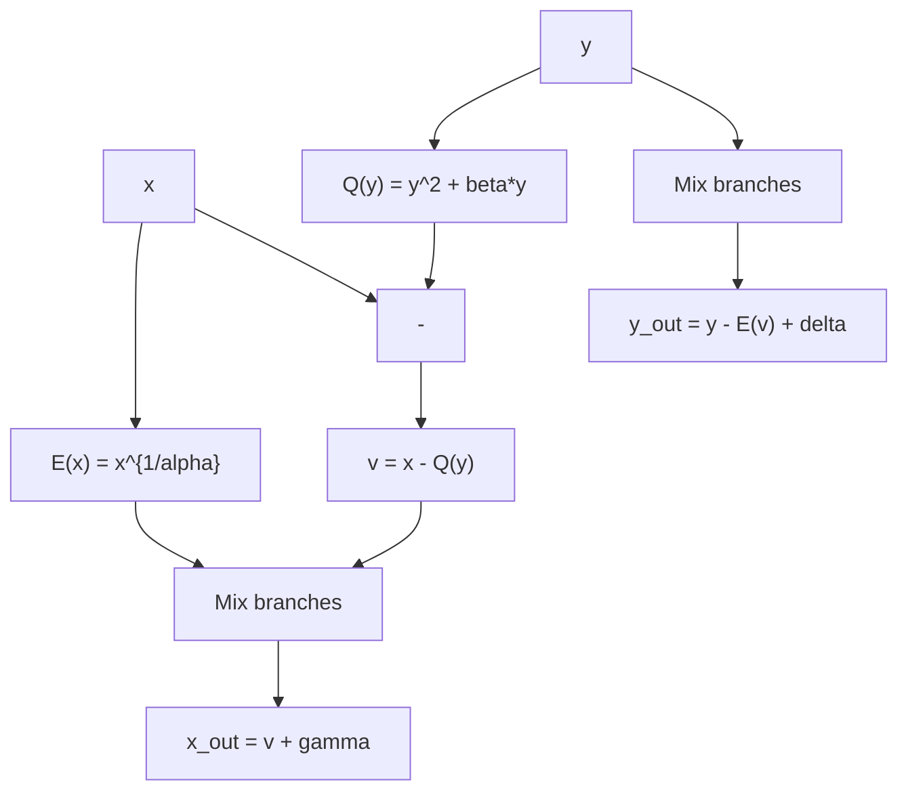

# Anemoi

## Overview

**Anemoi** is an AO hash function that introduces the **Flystel** construction,
a novel approach to building the nonlinear layer. Instead of applying a simple
power map, Anemoi uses a 2-branch open Flystel that provides both efficiency and
strong algebraic properties.

- **Authors**: Bouvier, Briaud, Chaidos, Perrin, Salen, Velichkov, Willems
- **Year**: 2022
- **S-box**: Open Flystel (based on $x^{\alpha}$ and $x^{1/\alpha}$)
- **Structure**: SPN with Flystel nonlinear layer

## The Flystel construction

The **open Flystel** operates on pairs $(x, y)$:

1. Compute $E(x) = x^{1/\alpha}$ (the "expensive" direction)
2. Compute $Q(y) = y^2 + \beta \cdot y$ (quadratic function)
3. Mix: the two branches interact to produce the output pair

The key insight is that the open Flystel is:

- Efficient to evaluate **forward** (uses $x^{1/\alpha}$ which is cheap
  in-circuit for some proof systems)
- Hard to invert (requires solving a system involving both $x^{\alpha}$ and the
  quadratic)

## Security properties

Anemoi's security analysis emphasizes:

1. **Groebner basis resistance**: the Flystel structure produces polynomial
   systems with higher solving degree than simple power maps
2. **Differential uniformity**: analyzed through the composite structure of the
   Flystel
3. **Algebraic degree**: the combination of $x^{\alpha}$ and $x^{1/\alpha}$ in
   the Flystel provides fast degree growth

## Security timeline

### 2022 - Original paper

Introduces Anemoi with comprehensive security analysis including Groebner basis
experiments, differential analysis, and algebraic degree bounds.

### 2023 - Subsequent analyses

Further study of the Flystel structure's resistance to algebraic attacks.

## Sage code

Reference implementation: `sage/anemoi/flystel.sage`

## References

- Bouvier, Briaud, Chaidos, Perrin, Salen, Velichkov, Willems. "New Design
  Techniques for Efficient Arithmetization-Oriented Hash Functions: Anemoi
  Permutations and Jive Compression Mode" (CRYPTO 2023)
  [ePrint 2022/840](https://eprint.iacr.org/2022/840)
