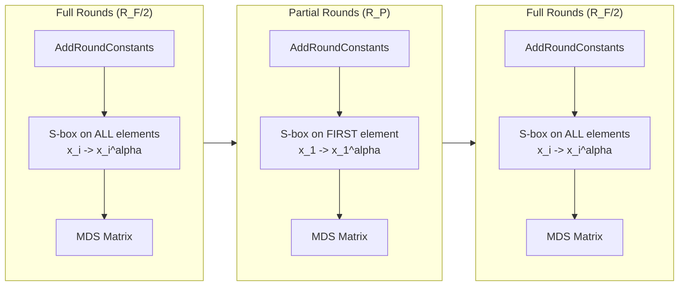

# Poseidon

## Overview

**Poseidon** is an arithmetization-oriented hash function designed for
zero-knowledge proof systems. It uses the sponge construction with a permutation
built from power map S-boxes ($x^{\alpha}$), MDS matrices, and a mix of full and
partial rounds.

- **Authors**: Grassi, Khovratovich, Rechberger, Roy, Schofnegger
- **Year**: 2019 (ePrint), 2021 (USENIX Security)
- **S-box**: $x^{\alpha}$ where $\alpha \in \{3, 5, 7, 11, \ldots\}$ (smallest
  $\alpha$ with $\gcd(\alpha, p-1) = 1$)
- **Structure**: SPN with full rounds + partial rounds

## Construction

### State and parameters

- State width: $t$ field elements over $\mathbb{F}_p$
- Rate: $r$ elements (absorbed/squeezed per call)
- Capacity: $c = t - r$ elements
- Security level: $M$ bits (typically 128)

### Round function

Each round applies:

1. **AddRoundConstants**: $x_i \gets x_i + c_i^{(r)}$
2. **S-box layer**:
   - Full round: $x_i \gets x_i^{\alpha}$ for all $i$
   - Partial round: $x_1 \gets x_1^{\alpha}$, others unchanged
3. **MDS mixing**: $(x_1, \ldots, x_t) \gets M \cdot (x_1, \ldots, x_t)$

### Round structure

The permutation uses $R_F$ full rounds and $R_P$ partial rounds, arranged as:

$$
\underbrace{R_F/2 \text{ full rounds}}_{\text{beginning}} \to \underbrace{R_P \text{ partial rounds}}_{\text{middle}} \to \underbrace{R_F/2 \text{ full rounds}}_{\text{end}}
$$

The partial rounds reduce the constraint count in R1CS/Plonk while maintaining
security through the surrounding full rounds.

## Parameter sets

| Instance         | $p$          | $t$ | $\alpha$ | $R_F$ | $R_P$ | Security |
| ---------------- | ------------ | --- | -------- | ----- | ----- | -------- |
| BN254, $t=3$     | BN254 scalar | 3   | 5        | 8     | 57    | 128 bit  |
| BN254, $t=5$     | BN254 scalar | 5   | 5        | 8     | 60    | 128 bit  |
| BLS12-381, $t=3$ | BLS scalar   | 3   | 5        | 8     | 57    | 128 bit  |

## Security timeline

### 2019 - Original paper

Grassi et al. introduce Poseidon with security arguments based on:

- Interpolation attack resistance: requires $\alpha^r > p$
- Groebner basis attack resistance: assumes semi-regular system
- Differential/linear attack resistance: negligible probability per trail

### 2020 - Keller and Rosemarin

"STARK Friendly Hash Survey" provides Groebner basis experiments on
reduced-round variants, suggesting the security margins may be tighter than
originally claimed.

### 2022 - Bariant et al.

"Algebraic Attacks against Some Arithmetization-Oriented Primitives" shows that
the polynomial systems from Poseidon are **not semi-regular** due to the partial
round structure, enabling more efficient Groebner basis attacks than predicted.

### 2023 - Grassi (degree analysis)

Tighter bounds on algebraic degree growth through partial rounds.

## Sage code

Reference implementation: `sage/poseidon/permutation.sage`

## References

- Grassi, Khovratovich, Rechberger, Roy, Schofnegger. "Poseidon: A New Hash
  Function for Zero-Knowledge Proof Systems" (USENIX Security 2021)
  [ePrint 2019/458](https://eprint.iacr.org/2019/458)
- Keller, Rosemarin. ["STARK Friendly Hash"](https://eprint.iacr.org/2020/948)
  (2020)
- Bariant, Peyrin.
  ["Algebraic Attacks against Some Arithmetization-Oriented Primitives"](https://eprint.iacr.org/2022/1058)
  (2022)
