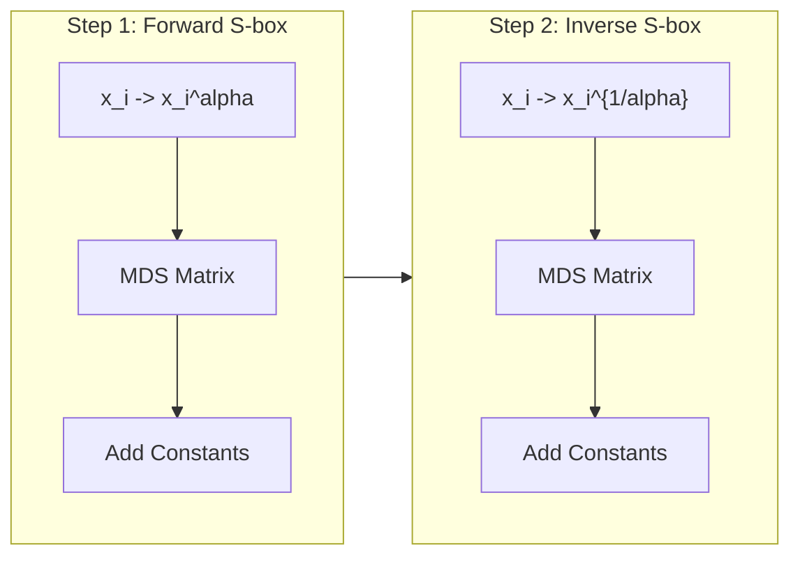

# Rescue / Rescue-Prime

## Overview

**Rescue** is one of the earliest AO hash functions. Its key innovation is using
**both** the power map $x^{\alpha}$ and its inverse $x^{1/\alpha}$ in
alternating rounds. This ensures fast algebraic degree growth in both the
forward and backward directions, making it resistant to attacks that exploit low
degree in either direction.

- **Authors**: Aly, Ashur, Ben-Sasson, Groce, Gupta
- **Year**: 2020
- **S-box**: $x^{\alpha}$ (even rounds), $x^{1/\alpha}$ (odd rounds)
- **Structure**: SPN

**Rescue-Prime** is a refined version with:

- Simpler parameter generation
- Tighter security bounds
- Optimized for STARK-friendly fields

## Construction

Each round consists of two steps:

**Step 1** (forward S-box):

1. S-box: $x_i \gets x_i^{\alpha}$ for all $i$
2. MDS: $(x_1, \ldots, x_t) \gets M \cdot (x_1, \ldots, x_t)$
3. Constants: $x_i \gets x_i + c_i$

**Step 2** (inverse S-box):

1. S-box: $x_i \gets x_i^{1/\alpha}$ for all $i$
2. MDS: $(x_1, \ldots, x_t) \gets M \cdot (x_1, \ldots, x_t)$
3. Constants: $x_i \gets x_i + c_i'$

The alternation between $x^{\alpha}$ and $x^{1/\alpha}$ means:

- Forward direction: degree grows as $\alpha$ per step 1, then
  $\alpha^{-1} \cdot (p-1)$ equivalent per step 2
- Backward direction: similarly fast growth

This dual S-box prevents the "low degree in one direction" weakness.

## Security timeline

### 2020 - Original paper

Introduces Rescue with detailed security analysis against interpolation,
Groebner basis, and differential attacks.

### 2020 - Rescue-Prime

Simplified version with cleaner parameter generation.

## References

- Aly, Ashur, Ben-Sasson, Groce, Gupta. "Efficient Symmetric Primitives for
  Advanced Cryptographic Protocols" (2020)
  [ePrint 2020/1143](https://eprint.iacr.org/2020/1143)
- Szepieniec, Ashur, Dhooghe. "Rescue-Prime: a Standard Specification (SoK)"
  (2020)
